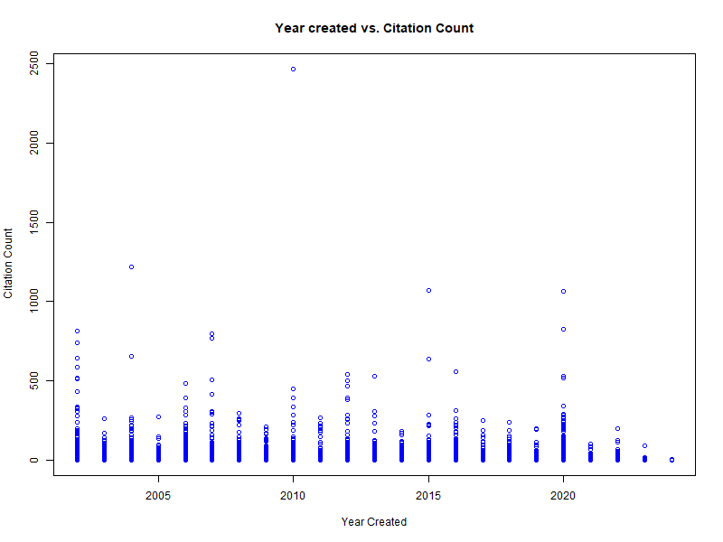
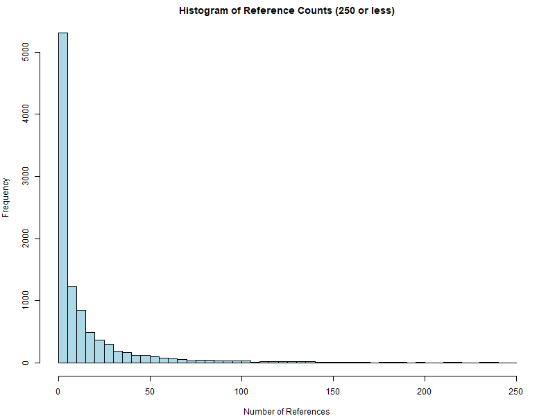
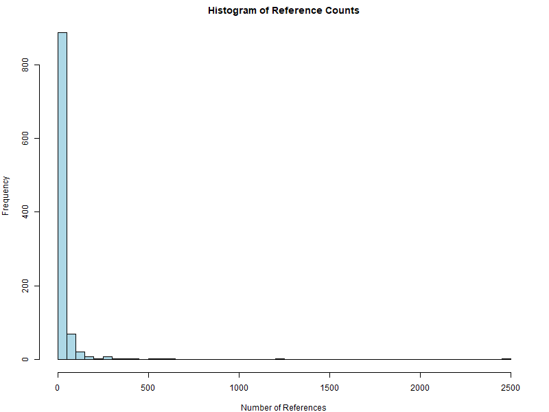
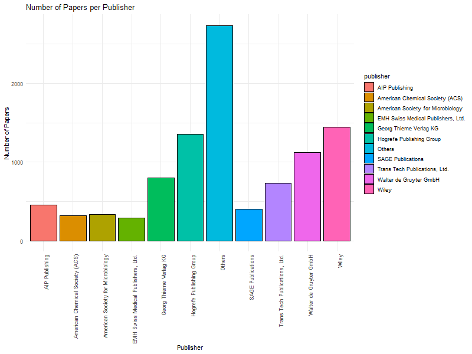
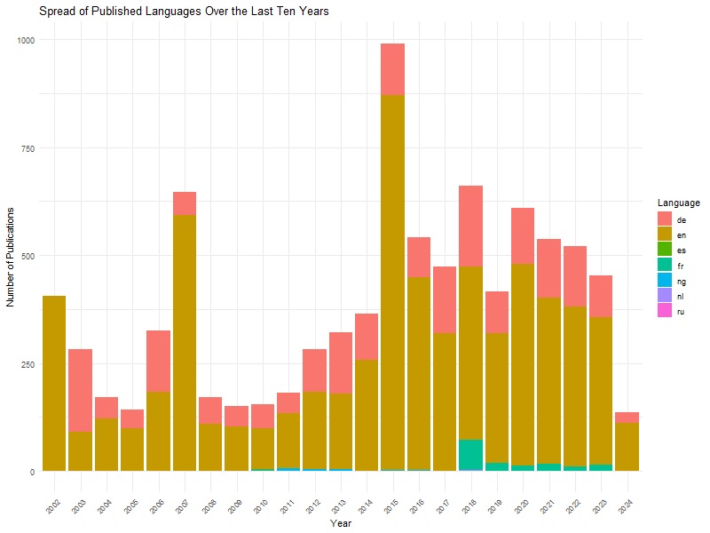

# What Makes a Successful Journal Article?

------------------------------------------------------------------------

::: {style="text-align: center;"}
::: {style="text-align: center;"}
*`Lisa Florentina Scherrer`*

Data Mining For Political and Social Science in R

{width="189"}
:::
:::

## 1 Introduction

For my capstone project I wanted to make a data analysis of the journal articles. I am focusing on the journal articles that are by authors, that are affiliated with the University of Lucerne in order to answer my research question on the connection between different meta data and the amount of citations of these journal articles and ultimately to answer what makes a successful paper.

For this purpose I retrieved the meta data of the specified journal articles through a REST API which is described in more detail in the following chapter *2 Retrieving Crossref Data.* An additional step was to join the separate data sets into one as explained in chapter *3 Joining the Data*. Next the raw data was transformed and displayed through a list of the top 10 most published articles as well as number of visualisations, including a stacked plot and a scatter plot, connecting the meta data variables and the amount of citations. Through these an analysis was made to understand the links between the independent variables language, year of creation and the dependent variable reference count. These two steps are detailed in chapter *4 Visualisation and Analysis*. Finally, in chapter *5 Conclusion* the findings and limitations of this research project are summarised.

## 2 Retrieving Journal Article Data

To access data related to journal articles the REST API by Crossref was used. To establish the connection a GET request was made. In the case of this API it is only possible to request 1000 journal articles per request made.

In order to automate the process of making several requests a loop was created. However, it was not possible to access more than 10000 articles in total. This was only discovered later when looking at the contents of the data and found the last request information to be empty. To avoid the for loop running until the total of 276 000 journal article data was retrieved an if condition was implemented. When the infomation contains less then 10 000 characters the loop stops and the following empty information is not requested.

Additionally, the data should be saved immediately after every request. In the case of this data set it was not possible to use *write.csv()* since the information was not two dimensional. The author column for instance contained further lists detailing the different authors and further the institutions they were affiliated with. That is why the data was saved with *save()* to create a file in .Rda format.

## 3 Joining the Data

to get all the data I needed which I joined together as "df_journal".

## 4 Analysis and Visualisation

```{r}
print(top_papers)
View(top_papers)
```


I was interested in the following questions:

-   How many references do the journal articles have?

-   What role does the language of the articles play in the amount of references?

-   Which are the most common publishers?

-   What is the connection between time and reference count?











## 5 Conclusion
