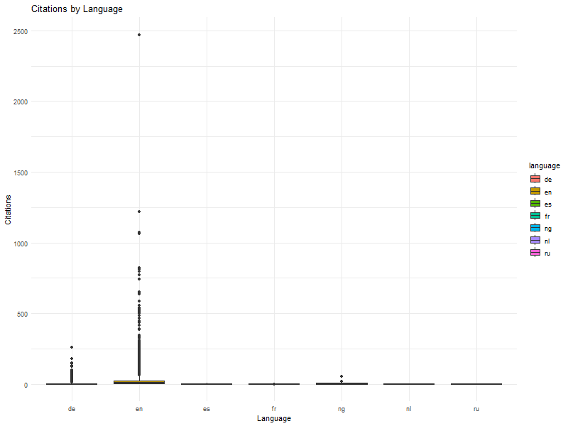
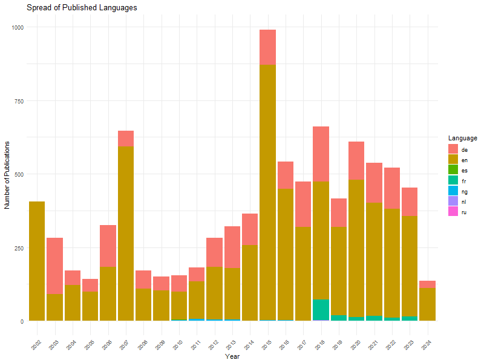

# What Makes a Successful Journal Article?

------------------------------------------------------------------------

::: {style="text-align: center;"}
::: {style="text-align: center;"}
*`Lisa Florentina Scherrer`*

Data Mining For Political and Social Science in R

{width="189"}
:::
:::

## 1 Introduction

The of this project are journal articles that are by authors affiliated with the University of Lucerne. In order to answer my research question on the connection between different meta data and the amount of citations of these journal articles and ultimately to answer what makes a successful paper.

In the following chapter *2 Hypothesis* the assumptions about this purpose I retrieved the meta data of the specified journal articles through a REST API which is described in more detail in chapter *3 Retrieving Data.* Next the raw data was transformed and displayed through a number of visualisations, including a stacked plot and a scatter plot, connecting the meta data variables and the amount of citations. These two steps are detailed in chapter *4 Analysis and Visualisation*. Finally, in chapter *5 Conclusion* the findings and limitations of this research project are summarised.

## 2 Hypotheses

The parameter for a successful article and dependent variable is the amount of references. The university is a young institution not having published studies with "cult status", the first Hypothesis (H1) is that there are very few highly cited articles. However, these articles can gain acclaim through discussing current topics, therefore recent publications are more popular (H2). The language of the article also plays a role due to the increasing importance of English, that is why English publications are cited more often than other papers (H3) and the share of English publications has increased (H4). Lastly, articles that are of an interdisciplinary nature are relevant to more research fields and yield better results and regardless of the few study programms offered the publishers are diverse (H5).

## 3 Retrieving Data

### 3.1 GET Request

To access data related to journal articles the REST API by Crossref was used. To establish the connection a GET request was made. In the case of this API it is only possible to request 1000 journal articles per request made.

In order to automate the process of making several requests a loop was created. However, it was not possible to access more than 10000 articles in total. This was only discovered later when looking at the contents of the data and found the last request information to be empty. To avoid the for loop running until the total of 276 000 journal article data was retrieved an if condition was implemented. When the infomation contains less then 10 000 characters the loop stops and the following empty information is not requested.

### 3.2 Saving and Transforming

Additionally, the data should be saved immediately after every request. In the case of this data set it was not possible to use *write.csv()* since the information was not two dimensional. The author column for instance contained further lists detailing the different authors and further the institutions they were affiliated with. That is why the data was saved with *save()* to create a file in .Rda format.

Since the data had to be requested multiple times these seperate responses were joined into one file. For this purpose a Loop was created to merge these data frames together as df_journal. The data was saved in a .Rda file format again because of the complexity of the data.

## 4 Analysis and Visualisation

### 4.1 Reference Count

*Figure 1* and *Figure 2* represent the distribution of the reference counts of the articles, while all articles with reference count NA were removed. It is apparent that there is a strong tendency for articles to have very few citations as previously hypothesised (H1).

As visible in *Figure 2* the papers quoted 0-5 exceed 5000 and represent more than half of the sample.

### 4.2 Timeline

To analyse a possible corralation between the year the articles were written and their citation count these two variables were plotted against each other in *Figure 3.* In the scatter plot there does not seem to be a visible connection between the two variables, therefore not fulfilling the requirements for further analysis with a regression model and disproving H2.

### 4.3 Language

Regarding the language of publication there is a clear trend in terms of citation count. As previously hypothesised the articles written in English are cited significantly more frequently than other languages as depicted in *Figure 4* and therefore supports H3.

In *Figure 5* we can see that there is no clear development regarding the language of publication. However, there does seem to be a slight decrease of the share of articles published in German compared to the English articles which have always significantly outweighed the ones in other languages. Despite the political importance of French and increase in publications since 2018 the amount of French articles are still significantly lower than the German and English publications.

### 4.4 Publisher

According to H5 there the articles should be published in a wide array of research platforms. In order to test this hypothesis a bar chart was created showcasing the 10 most common publishers. In *Figure 5* the variety of publishers focusing on a host of different fields including *Trans Tech Publications, Ltd.,* the *American Society for Microbiology* and *Horgefe Publishing Group*. This is in line with H4.

## 5 Conclusion

### 5.1 Findings

In summary, this paper shows how different types of metadata are connected to highly cited, and therefore successful, journal articles by authors affiliated with the University of Lucerne. In the analysis 4 Hypotheses were put to the test with the following results:

-   H1: Most articles of the university of Lucerne are very seldom cited. As speculated this could be due to the only recent founding of the institution.

-   H2: There is no clear trend towards publications being cited more often in recent years, which disproves our second Hypothesis.

-   H3: English publications are more successful and significantly more often cited than papers published in other languages, which supports H3.

-   H4: The share of English publications seems to have increased indicating that H4 might be correct. However, this correlation is not very strong and needs to be investigated further.

### 5.2 Limitations

This report was insightful in many aspects suggesting that most of our Hypotheses could be correct. Nevertheless, the sample is quite small with 10 000 journal articles and might not be representative of the actual trends concerning the metadata of these publications. Additionally, there need to be more investigations made on each of the Hypotheses to confirm or suggest a strong link between the variables.
